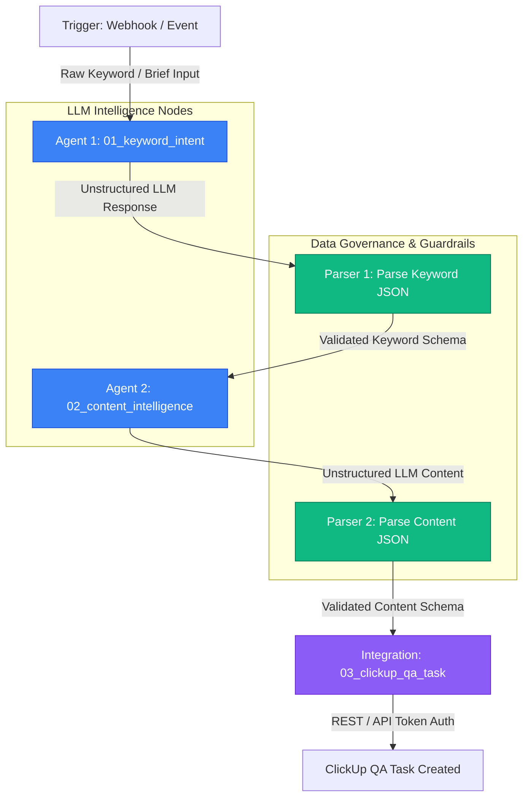
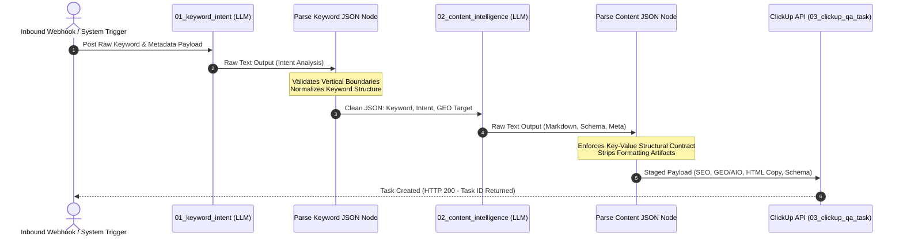

# Enterprise RevOps Agentic Execution Engine

> Decoupled, schema-governed RevOps content production pipeline built on n8n, node-level JSON Schema validation, and ClickUp QA task staging.

---

## Executive Summary: Operational Paradigm Shift

| Operational Dimension | Manual Approval Workflows (Legacy) | Sovereign Agentic Pipeline (Engine) |
| :--- | :--- | :--- |
| **Execution Model** | Step-by-step human prompts & approval gating | Event-driven, fully autonomous execution |
| **Data Integrity** | Hallucination-prone, unvalidated text blobs | Hardened JSON Schema (Draft 2020-12) validation |
| **Domain Control** | Prompt drift across non-standard topics | Strict vertical enum enforcement (Exterior Services) |
| **Delivery Model** | Manual copy-pasting between platforms | Direct REST API integration to task staging |

Most operational RevOps teams rely on fragile "chat-based" setups—forcing team members to sit and manually "babysit" execution runs, re-prompting LLMs for missing fields, and manually formatting data across project management tools.

**`enterprise-revops-agentic-pipeline`** replaces manual oversight with an event-driven engine. Raw inbound triggers are processed, normalized, enforced against structural data contracts, and delivered directly as QA tasks with zero manual intervention required.

---

## Architecture & Data Flow

### Pipeline Execution Flow


### End-to-End Sequence Flow


---

## Architectural Pattern

The engine implements a **Decoupled Agentic Pattern** backed by schema-based data governance:

1. **Event-Driven Ingestion:** Inbound webhooks process raw keyword briefs directly into the execution flow.
2. **Intent Analysis & Vertical Enforcement (`01_keyword_intent`):** Context-hardened LLM normalizes target keywords, search intent, and geographic targeting. Discards requests outside core home exterior verticals (`roofing`, `siding`, `gutters`, `solar`, `fencing`, `decks`).
3. **Data Governance Step 1 (`keyword_intent.schema.json`):** Intermediate JavaScript parsing node validates intent outputs against strict schema contracts before invoking downstream generation models.
4. **Content Generation Engine (`02_content_intelligence`):** Generates optimized SEO meta elements, GEO/AIO search answers, semantic HTML bodies, JSON-LD structured data scripts, and Google Business Profile updates.
5. **Data Governance Step 2 (`content_intelligence.schema.json`):** Standardizes key-value deliverables, stripping markdown code block wrappers to produce clean JSON payloads.
6. **Automated QA Staging (`03_clickup_qa_task`):** Authenticates via Personal API Tokens (`pk_...`) to construct structured QA briefs within designated ClickUp boards (`SEO and Content`).

---

## Repository Structure

```text
 enterprise-revops-agentic-pipeline/
├── prompts/
│   └── system/                  # Version-controlled system prompts
├── schemas/
│   ├── keyword_intent.schema.json       # Schema contract for intent validation
│   └── content_intelligence.schema.json # Schema contract for content payload
├── workflows/                   # Exported n8n workflow definitions
└── README.md                    # Architecture documentation & system spec
```

---

## Key Impact & Business Value

* **Zero Human Execution Friction:** Completely eliminates manual multi-step prompt babysitting and copy-pasting.
* **Deterministic Reliability:** Schema enforcement guarantees malformed LLM outputs or missing fields never break downstream integrations.
* **Enterprise Security:** Decoupled credential management via direct API tokens prevents session contamination across workspace tenants.
