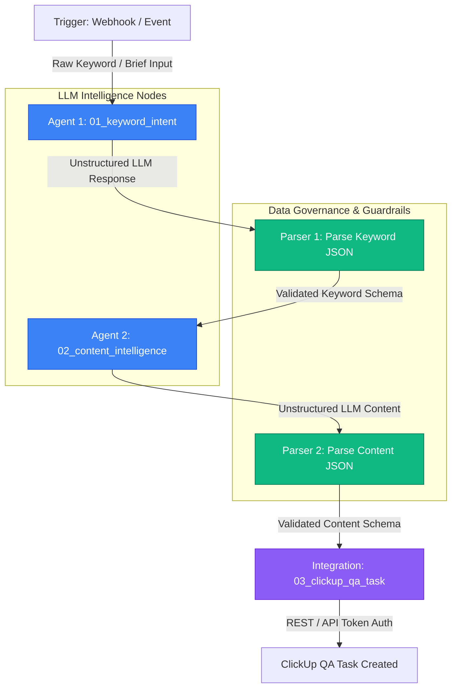
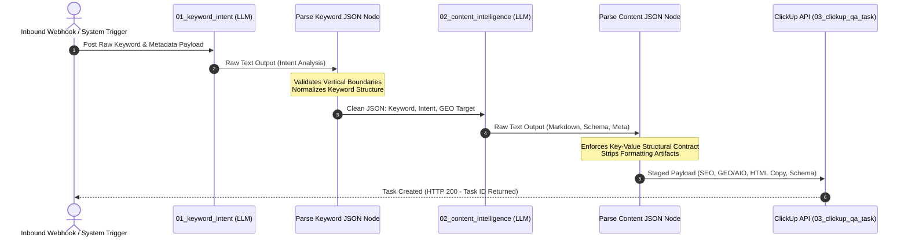

# enterprise-revops-agentic-pipeline
Portable architecture and n8n/Claude workflows for RevOps content generation and fulfillment.

```mermaid
graph TD
    %% Nodes
    A[Trigger: Webhook / Event] -->|Raw Keyword / Brief Input| B[Agent 1: 01_keyword_intent]
    B -->|Unstructured LLM Response| C[Parser 1: Parse Keyword JSON]
    C -->|Validated Keyword Schema| D[Agent 2: 02_content_intelligence]
    D -->|Unstructured LLM Content| E[Parser 2: Parse Content JSON]
    E -->|Validated Content Schema| F[Integration: 03_clickup_qa_task]
    F -->|REST / API Token Auth| G[ClickUp QA Task Created]

    %% Data Governance & Guardrails
    subgraph Data Governance & Guardrails
        C
        E
    end

    subgraph LLM Intelligence Nodes
        B
        D
    end

    %% Styling
    style B fill:#3b82f6,stroke:#1d4ed8,color:#fff
    style D fill:#3b82f6,stroke:#1d4ed8,color:#fff
    style C fill:#10b981,stroke:#047857,color:#fff
    style E fill:#10b981,stroke:#047857,color:#fff
    style F fill:#8b5cf6,stroke:#6d28d9,color:#fff
```

## End-to-End Sequence Flow

```mermaid
sequenceDiagram
    autonumber
    actor Trigger as Inbound Webhook / System Trigger
    participant Agent1 as 01_keyword_intent (LLM)
    participant Parser1 as Parse Keyword JSON Node
    participant Agent2 as 02_content_intelligence (LLM)
    participant Parser2 as Parse Content JSON Node
    participant ClickUp as ClickUp API (03_clickup_qa_task)

    Trigger->>Agent1: Post Raw Keyword & Metadata Payload
    Agent1->>Parser1: Raw Text Output (Intent Analysis)
    Note over Parser1: Validates Vertical Boundaries<br/>Normalizes Keyword Structure
    Parser1->>Agent2: Clean JSON: Keyword, Intent, GEO Target
    Agent2->>Parser2: Raw Text Output (Markdown, Schema, Meta)
    Note over Parser2: Enforces Key-Value Structural Contract<br/>Strips Formatting Artifacts
    Parser2->>ClickUp: Staged Payload (SEO, GEO/AIO, HTML Copy, Schema)
    ClickUp-->>Trigger: Task Created (HTTP 200 - Task ID Returned)
```
